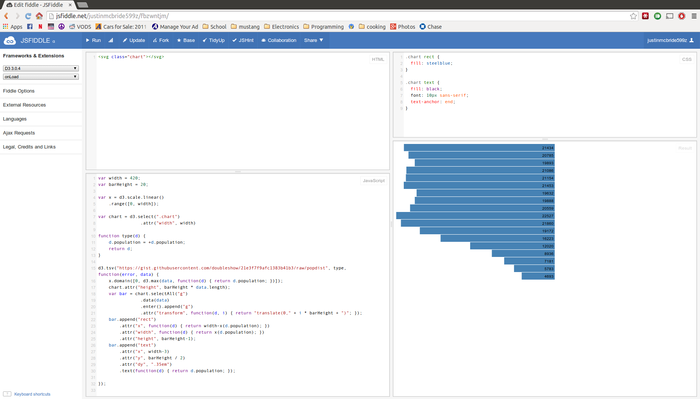
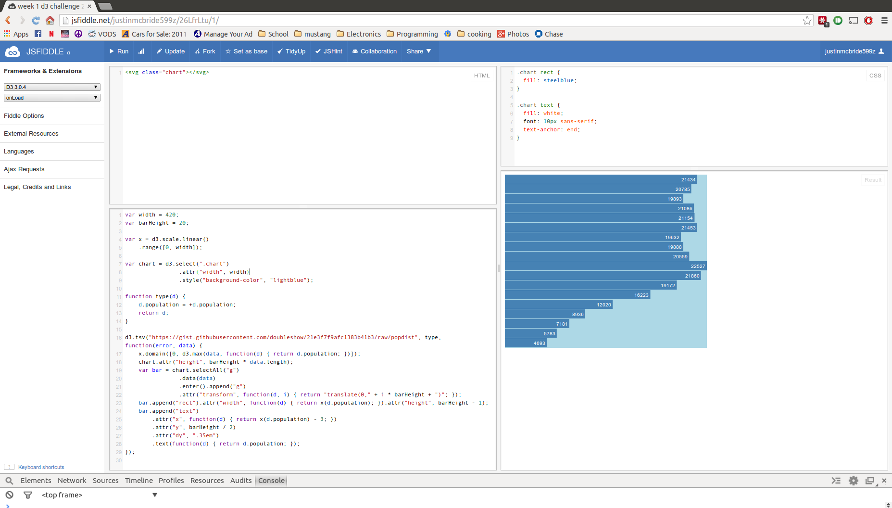
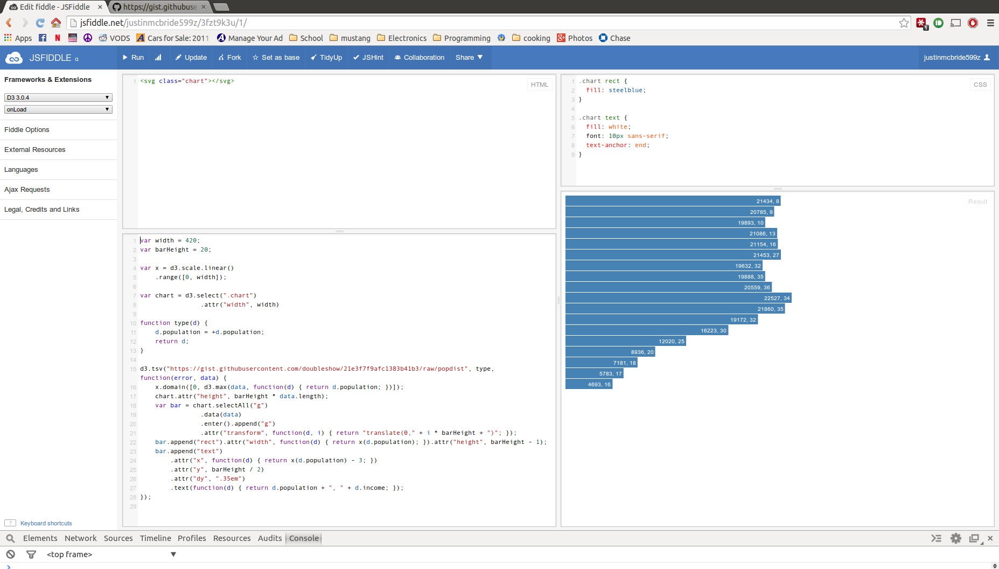
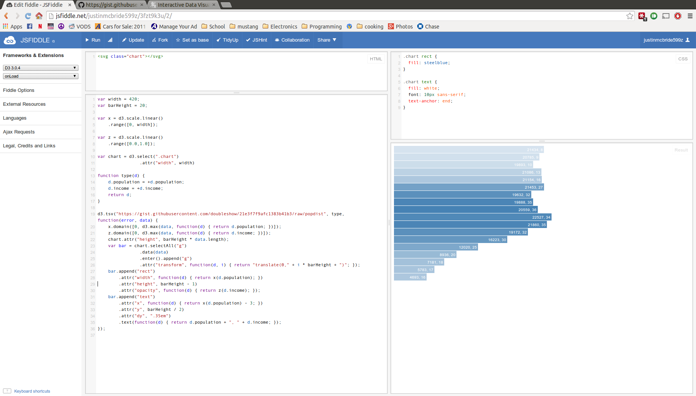

# Name

write-your-name

# How many points have you earned?

0/100

(Make your own calculation and replace the number 0 with the points you think you've earned.)

# Show and tell (5 points)

[title-of-the-article](http://link-to-an-interesting-news-article-about-big-data)

# Splunk

## Checkpoint 1 (10 points)

## Checkpoint 2 (10 points)

# D3

## Checkpoint 1 (10 points)

## Checkpoint 2 (10 points)

## Study Questions (5 points x 3 = 15 points)

### Q1. (5 points)

Any time you access the data with the 'd' variable, you would need to change which member of that variable you're trying to reach. For example, d.firstname and d.count.

### Q2. (5 points)

Using D3 gives us complete control over the graphical representations of the graph, in addition to the way in which the data is parsed. It may be more versatile in the long run, accepting various types of input and displaying them appropriately.

### Q3. (5 points)

The 'type' argument is an accessor function that will parse the data and format it in a way that makes it usable to our code.

## Challenge 1 (5 points)

[JSFiddle Link](http://jsfiddle.net/justinmcbride599z/cgck4was/)

## Challenge 2 (5 points x 7 = 35 points)

### a. 

[JSFiddle Link](http://jsfiddle.net/justinmcbride599z/6c45wvsu/)

### b.

[JSFiddle Link]()

### c.

[JSFiddle Link](http://jsfiddle.net/justinmcbride599z/52m67jeu/)

### d.

[JSFiddle Link](http://jsfiddle.net/justinmcbride599z/fbzwntjm/)

### e.

[JSFiddle Link](http://jsfiddle.net/justinmcbride599z/26LfrLtu/1/)

### f.

[JSFiddle Link](http://jsfiddle.net/justinmcbride599z/3fzt9k3u/1/)

### g.

[JSFiddle Link](http://jsfiddle.net/justinmcbride599z/3fzt9k3u/2/)
