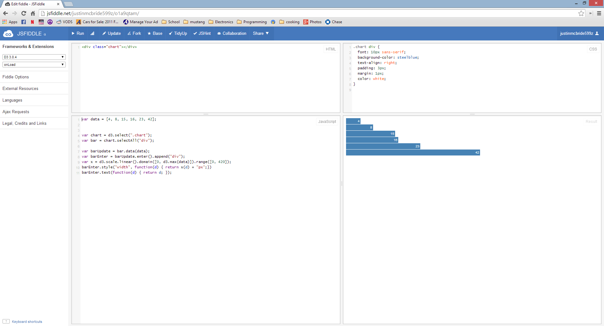
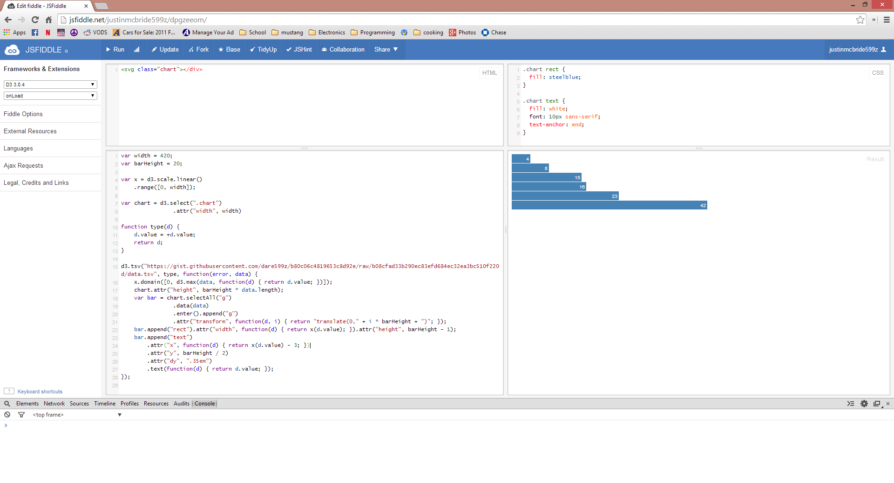
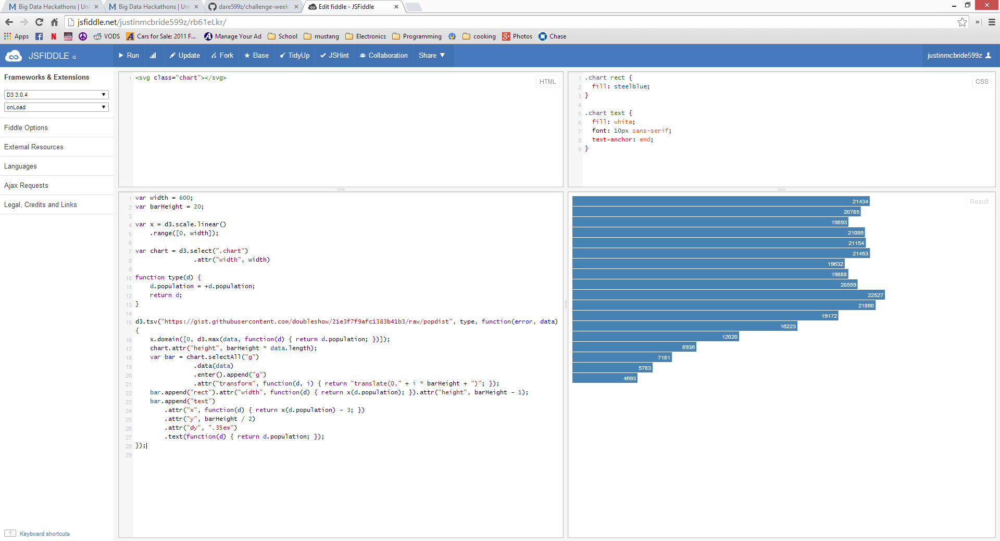
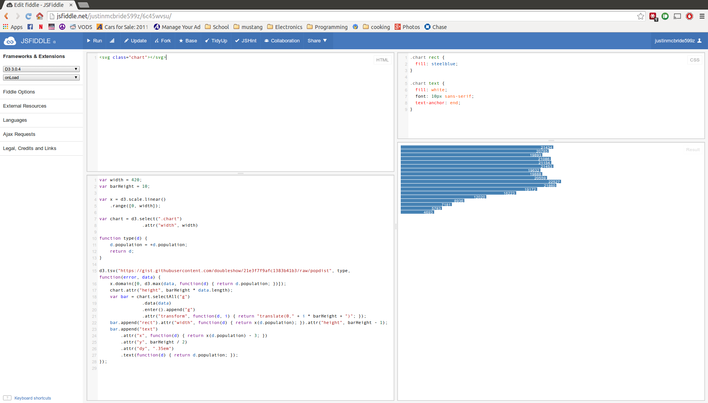
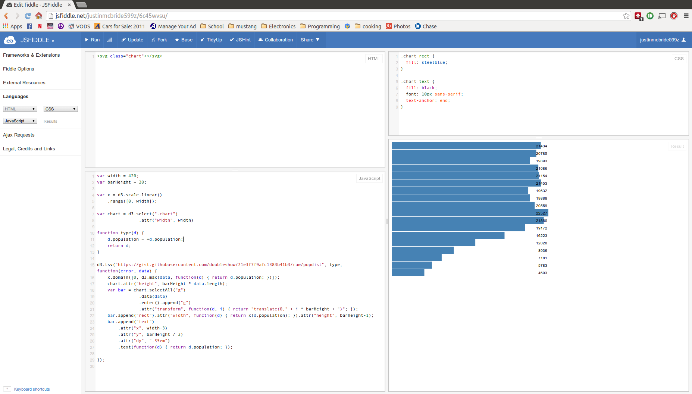

# Name

write-your-name

# How many points have you earned?

0/100

(Make your own calculation and replace the number 0 with the points you think you've earned.)

# Show and tell (5 points)

[title-of-the-article](http://link-to-an-interesting-news-article-about-big-data)

# Splunk

## Checkpoint 1 (10 points)

## Checkpoint 2 (10 points)

# D3

## Checkpoint 1 (10 points)

## Checkpoint 2 (10 points)

## Study Questions (5 points x 3 = 15 points)

### Q1. (5 points)

fill-in-your-answer

### Q2. (5 points)

fill-in-your-answer

### Q3. (5 points)

fill-in-your-answer

## Challenge 1 (5 points)

[JSFiddle Link](http://jsfiddle.net/justinmcbride599z/cgck4was/)

## Challenge 2 (5 points x 7 = 35 points)

### a. 

[JSFiddle Link](http://jsfiddle.net/justinmcbride599z/6c45wvsu/)

### b.

[JSFiddle Link]()

### c.

[JSFiddle Link](http://jsfiddle.net/justinmcbride599z/52m67jeu/)

### d.

[JSFiddle Link](http://jsfiddle.net/justinmcbride599z/fbzwntjm/)

### e.

[JSFiddle Link](http://jsfiddle.net/replace-this-path)

### f.

[JSFiddle Link](http://jsfiddle.net/replace-this-path)

### g.

[JSFiddle Link](http://jsfiddle.net/replace-this-path)
