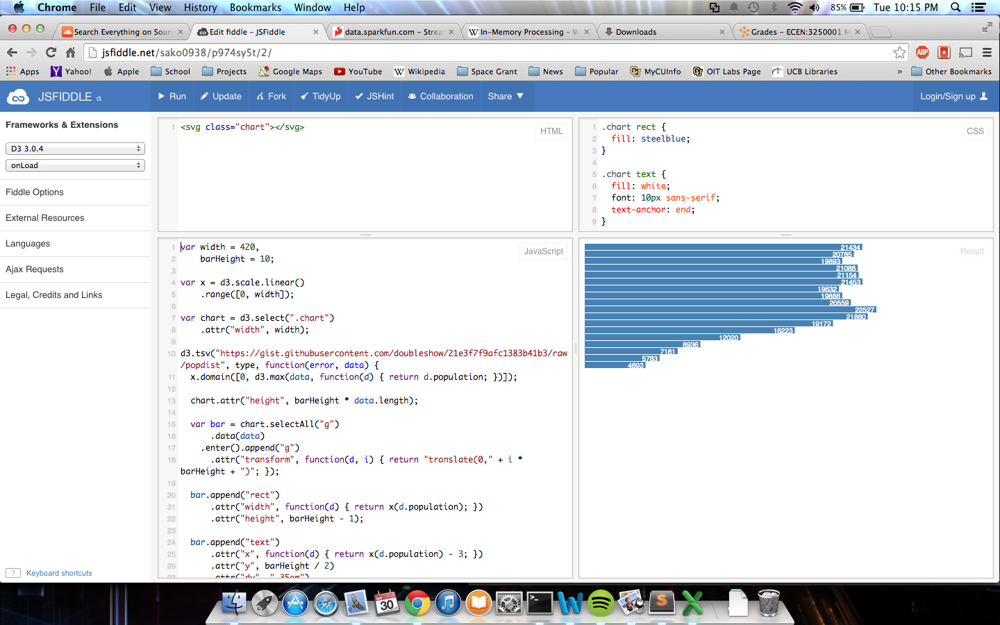

# Name

Sam Korn

# How many points have you earned?

0/100

(Make your own calculation and replace the number 0 with the points you think you've earned.)

# Show and tell (5 points)

[The Breakthrough Technology That Will Turbocharge Big Data And Cloud Computing](http://www.forbes.com/sites/oracle/2014/09/12/the-breakthrough-technology-that-will-turbocharge-big-data-and-cloud-computing/)
This article is about incorporating "Software in Silicon" in order to make processors that speed up databases/servers. This allows for offloading functions like sorts, searches, etc. to the hardware in order to dramatically speed up database operations.

# Splunk

## Checkpoint 1 (10 points)

## Checkpoint 2 (10 points)

# D3

## Checkpoint 1 (10 points)

## Checkpoint 2 (10 points)

## Study Questions (5 points x 3 = 15 points)

### Q1. (5 points)

The bar chart stops being created when the second heading changes from value to count. In order to fix this we need to change all instances of d.value to d.count.

### Q2. (5 points)

The benefits of using D3 over Excel is that the result is dynamic and viewable on a webpage without a large program on the host machine. 

### Q3. (5 points)
The type parameter for the d3.tsv function tells how to treat the data that is finds in the tsv. It sends it to the type function in order to convert it to the proper type.

## Challenge 1 (5 points)

[JSFiddle Link](http://jsfiddle.net/p974sy5t/1/)

## Challenge 2 (5 points x 7 = 35 points)

### a. 

[JSFiddle Link](http://jsfiddle.net/sako0938/p974sy5t/2/)

### b.

[JSFiddle Link](http://jsfiddle.net/sako0938/p974sy5t/3/)

### c.

[JSFiddle Link](http://jsfiddle.net/sako0938/p974sy5t/4/)

### d.

[JSFiddle Link](http://jsfiddle.net/sako0938/p974sy5t/5/)

### e.

[JSFiddle Link](http://jsfiddle.net/sako0938/p974sy5t/6/)

### f.

[JSFiddle Link](http://jsfiddle.net/sako0938/p974sy5t/7/)

### g.

[JSFiddle Link](http://jsfiddle.net/sako0938/p974sy5t/8/)
